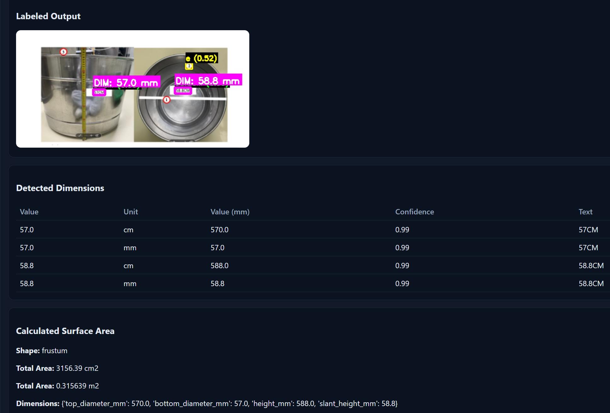
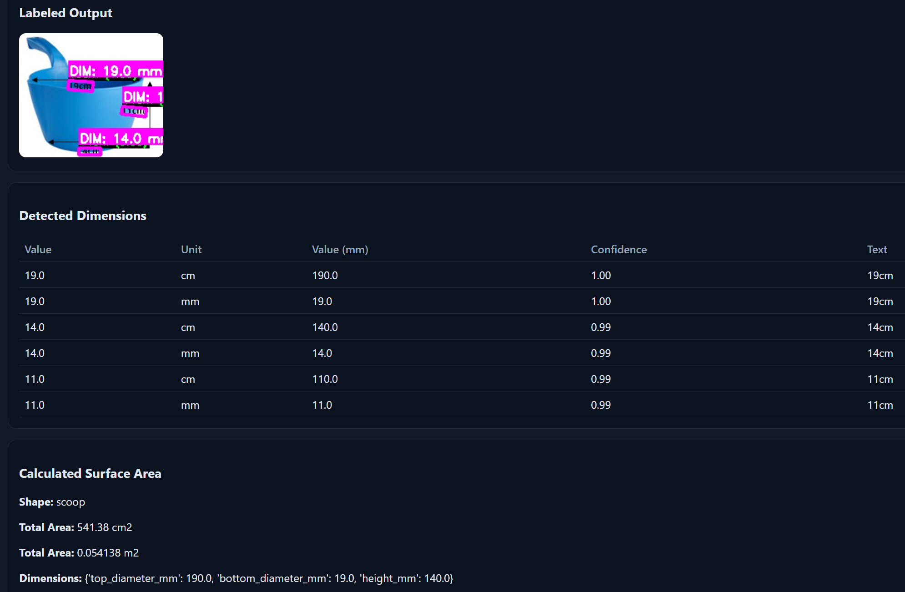

# Surface Measurement Tool

<div align="center">

**AI-powered OCR tool for automatic dimension detection and surface area calculation**

[](https://haseebjaved123.github.io/Surface-Measurement-Tool-/)
[](https://www.python.org/)
[](https://github.com/PaddlePaddle/PaddleOCR)

</div>

---

## 🎯 Overview

Automatically detect dimensions from images of industrial tools using **PaddleOCR** and calculate surface areas for cylinders, buckets, scoops, frustums, and rectangular containers. Upload an image → AI extracts measurements → instant surface area calculation.

---

## ✨ Features

- ✅ **Advanced OCR** - Uses PaddleOCR for robust text and dimension extraction
- ✅ **Image Preprocessing** - Automatic enhancement for better OCR accuracy
- ✅ **Smart Shape Detection** - Automatically identifies cylinder, bucket, scoop, frustum, or rectangular shapes
- ✅ **Surface Area Calculation** - Accurate geometric calculations with multiple unit outputs (mm², cm², m²)
- ✅ **Visual Labeling** - Generates labeled images showing detected dimensions
- ✅ **Web Interface** - Easy-to-use Flask web app for uploading and processing images
- ✅ **Enhanced Manual Calculator** - Advanced calculator with volume calculations, shape diagrams, calculation history, and 7 shape types (cylinder, rectangular, frustum, bucket, scoop, cone, sphere)

---

## 📸 How It Works

### OCR Processing Examples

The tool automatically detects dimensions from images and calculates surface areas:

#### Example 1: Bucket/Frustum Detection

<div align="center">



</div>

**Detected Dimensions:**
- Top diameter: **57.0 cm** (570.0 mm)
- Bottom diameter: **58.8 cm** (588.0 mm)  
- Height: **588.0 mm**

**Results:**
- Surface Area: **3156.39 cm²** (0.315639 m²)
- Shape identified: **Frustum**

---

#### Example 2: Scoop Detection

<div align="center">



</div>

**Detected Dimensions:**
- Top diameter: **19.0 cm** (190.0 mm)
- Bottom diameter: **14.0 cm** (140.0 mm)
- Height: **11.0 cm** (110.0 mm)

**Results:**
- Surface Area: **541.38 cm²** (0.054138 m²)
- Shape identified: **Scoop**

---

### Workflow

```
📷 Upload Image
    ↓
🔍 OCR Detection (PaddleOCR)
    ↓
📏 Dimension Extraction
    ↓
🧮 Shape Identification
    ↓
📊 Surface Area Calculation
    ↓
📝 Labeled Output + Results
```

---

## 🚀 Quick Start

### Manual Calculator (No Installation)

**[→ Open Manual Calculator](https://haseebjaved123.github.io/Surface-Measurement-Tool-/)** — Enter dimensions and get detailed surface area and volume calculations. Runs in your browser, no server needed.

<div align="center" style="background: rgba(248, 81, 73, 0.1); border: 1px solid rgba(248, 81, 73, 0.3); border-radius: 8px; padding: 1rem; margin: 1rem 0;">

**⚠️ Calculator Link Not Working?**

The link above shows 404 until GitHub Pages is enabled.  
**Quick fix:** See **[ENABLE_PAGES.md](ENABLE_PAGES.md)** for step-by-step instructions.

**Or:** Go to **Settings → Pages** → **Source: branch main, folder /docs** → **Save** → Wait 2 minutes

</div>

**Calculator Features:**
- 📐 **7 Shape Types:** Cylinder, Rectangular, Frustum, Bucket, Scoop, Cone, Sphere
- 📊 **Volume Calculations:** Get volume in cm³ and liters
- 📈 **Detailed Breakdown:** Lateral area, top/bottom areas separately
- 🎨 **Visual Diagrams:** SVG shape diagrams for each calculation
- 📝 **Calculation History:** View past calculations (stored locally)
- 📋 **Copy Results:** One-click copy of calculation results
- 🔄 **Multiple Units:** Input in mm, cm, or m

---

### Run Full App Locally (OCR + Calculator)

1. **Install dependencies:**
   ```bash
   pip install -r requirements.txt
   ```
   Or double-click **INSTALL.bat**

2. **Start the server:**
   ```bash
   python server.py
   ```
   Or double-click **RUN.bat**

3. **Open in browser:** http://127.0.0.1:8000

4. **Upload an image** with visible dimensions → OCR detects measurements → automatic surface area calculation

---

## 📊 Supported Shapes

| Shape | Required Dimensions | Use Case |
|-------|-------------------|----------|
| **Cylinder** | Diameter, Height | Tanks, pipes, containers |
| **Rectangular** | Length, Width, Height | Boxes, containers |
| **Frustum** | Top Ø, Bottom Ø, Height | Tapered containers |
| **Bucket** | Top Ø, Bottom Ø, Height | Industrial buckets |
| **Scoop** | Top Ø, Bottom Ø, Height | Measuring scoops |
| **Cone** | Base Diameter, Height | Conical hoppers, funnels |
| **Sphere** | Diameter | Spherical tanks, balls |

---

## 🛠️ Technology Stack

- **OCR Engine:** [PaddleOCR](https://github.com/PaddlePaddle/PaddleOCR) - State-of-the-art OCR with excellent accuracy on industrial images
- **Backend:** Flask (Python web framework)
- **Image Processing:** OpenCV, PIL
- **Frontend:** HTML5, CSS3, JavaScript (vanilla)
- **Manual calculator:** GitHub Pages (runs in browser). Full app runs locally or on a host.

---

## 📁 Project Structure

```
Surface-Measurement-Tool/
├── docs/
│   ├── index.html          # Manual Calculator (GitHub Pages)
│   └── images/             # Example outputs
├── server.py               # Web app (Flask + OCR)
├── main.py                 # CLI: process images
├── ocr_detector.py         # OCR functionality
├── image_preprocessor.py  # Image enhancement
├── geometry_calculator.py  # Surface area calculations
├── smart_calculator.py     # Shape detection logic
├── config.py              # Configuration
├── requirements.txt       # Dependencies
├── RUN.bat                # Run full app
├── INSTALL.bat            # Install dependencies
├── input_images/          # Place images here
├── output_images/         # Labeled results
├── processed_images/      # Enhanced images
└── results/               # JSON reports
```

---

## 💡 Usage Examples

### Process a single image:
```bash
python main.py --image path/to/image.jpg
```

### Process all images in a folder:
```bash
python main.py --dir path/to/images/
```

### Process images from default folder:
1. Place images in `input_images/`
2. Run: `python main.py`

---

## 📝 Output

The tool generates:
- **Labeled images** (`output_images/`) - Visual annotations showing detected dimensions
- **Enhanced images** (`processed_images/`) - Preprocessed images optimized for OCR
- **JSON results** (`results/results.json`) - Structured data with all calculations
- **Text reports** (`results/report.txt`) - Human-readable summary

---

## ⚙️ Configuration

Edit `config.py` to customize:
- OCR language (`OCR_LANG`)
- GPU acceleration (`OCR_USE_GPU`)
- Confidence threshold (`CONFIDENCE_THRESHOLD`)

---

## 📌 Notes

- First run downloads PaddleOCR models (~100MB) automatically
- Processing time: ~2-5 seconds per image (CPU)
- Works best with clear, well-lit images with visible dimension labels
- For GPU acceleration, set `OCR_USE_GPU = True` in `config.py`

---

## 🔗 Links

- **Manual Calculator (live):** [https://haseebjaved123.github.io/Surface-Measurement-Tool-/](https://haseebjaved123.github.io/Surface-Measurement-Tool-/)
- **Repository:** [https://github.com/haseebjaved123/Surface-Measurement-Tool-](https://github.com/haseebjaved123/Surface-Measurement-Tool-)

---

<div align="center">

**Built with ❤️ using PaddleOCR and Python**

</div>
